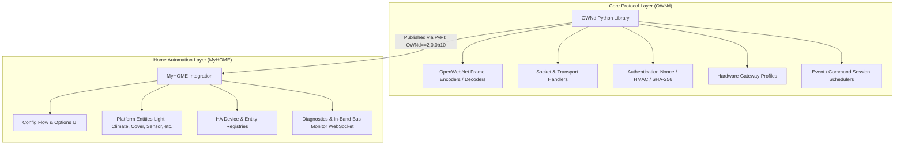
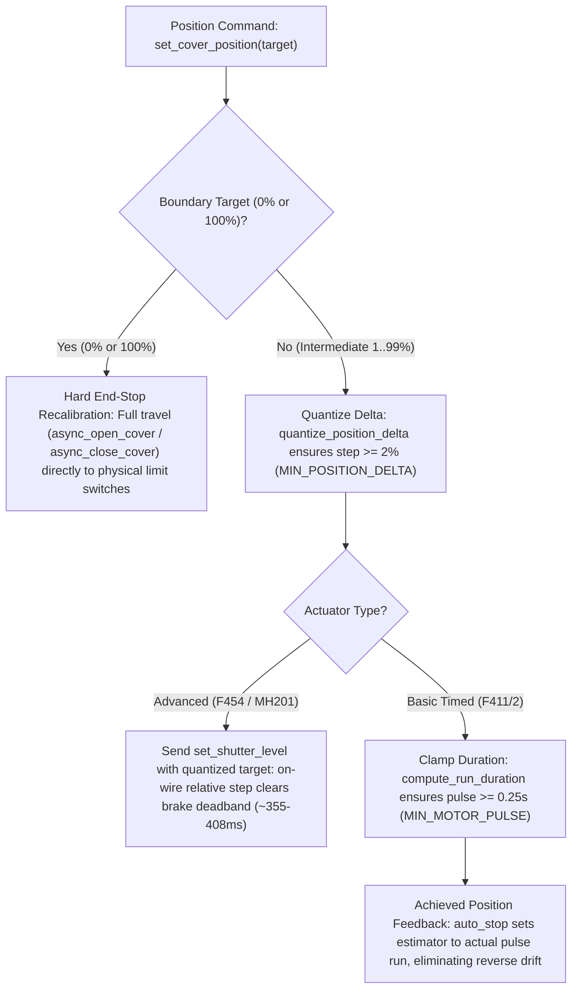

# Architecture & Anti-Drift Safeguards

This document explains the architectural separation between the **`OWNd`** OpenWebNet protocol library and the **`MyHOME`** Home Assistant custom integration, along with the multi-tiered **Anti-Drift Sentinel System** designed to ensure both codebases never diverge.

---

## 1. Architectural Overview: The Split Model

Starting with **MyHOME v2.0** and **OWNd 2.0**, the OpenWebNet protocol stack and the Home Assistant integration are cleanly decoupled into two dedicated repositories:



### Why Decouple?
1. **Single Source of Truth**: Protocol decoding, dimension parsing, and frame syntax rules exist in one authoritative library rather than duplicated or vendored across multiple projects.
2. **Reusability**: Other automation frameworks, standalone CLI tools, diagnostic bridges, and testing scripts can leverage `OWNd` without pulling in Home Assistant dependencies.
3. **Independent Release Cadence**: Protocol fixes and newly decoded WHO dimensions can be tested and released on PyPI independently.

---

## 2. The Drift Problem

When a core protocol library and a downstream consumer live in separate repositories, three critical divergence risks arise:

1. **Breaking Contract Changes**: A parameter change, field renaming, or return type modification in `OWNd` passes all `OWNd` unit tests but breaks `MyHOME` entities or listeners.
2. **Parser Regressions**: A change to a regular expression or frame parsing logic in `OWNd` causes downstream entity state updates or device triggers to silently fail.
3. **Dependency Desynchronization**: `MyHOME` pins a specific release in `manifest.json`, but development branches assume newer unreleased features (or vice versa).

To permanently prevent these issues, the project implements a **3-Pillar Anti-Drift Architecture**.

---

## 3. The 3-Pillar Anti-Drift Architecture

```mermaid
graph TD
    subgraph "Pillar 1: Shift-Left Downstream Canary (OWNd)"
        O1[OWNd PR or Commit] --> O2[Build Candidate OWNd Wheel]
        O2 --> O3[Checkout MyHOME integration]
        O3 --> O4[Run full MyHOME 1,600+ test suite]
        O4 -->|Any failure| O5[Block OWNd PR from Merging]
        O4 -->|All green| O6[Allow OWNd Merge]
    end

    subgraph "Pillar 2: Upstream Canary CI (MyHOME)"
        M1[Nightly Cron 04:00 UTC] --> M2[Install git+master of OWNd]
        M2 --> M3[Run MyHOME Test Suite & Enforcers]
        M3 -->|Alert on failure| M4[Proactive Warning Before PyPI Release]
    end

    subgraph "Pillar 3: Automated Release Bump"
        R1[OWNd PyPI Release] --> R2[repository_dispatch Webhook]
        R2 --> R3[Auto-Bump manifest.json & PR in MyHOME]
    end
```



### Pillar 1: Downstream Integration Canary in `OWNd` (Shift-Left Sentinel)

The most effective safeguard is **Shift-Left Testing**: stopping breaking changes before they are ever merged into `OWNd`.

In `OpenWebNet-HA/OWNd/.github/workflows/ci.yml`, every PR and push to `master` triggers a downstream verification job:

- The runner builds and installs the candidate `OWNd` wheel.
- It clones the active development branch of `OpenWebNet-HA/MyHOME` (`v2-phase1-architecture` or `master`).
- It runs the complete automated unit test suite of `MyHOME` with **strict 100.0% line coverage enforcement**.

> [!IMPORTANT]
> A pull request to `OWNd` **cannot merge** if it breaks any behavior, parser, or assumption in `MyHOME`.

---

### Pillar 2: Upstream Canary CI in `MyHOME` (Nightly Sentinel)

To detect upstream changes before they are tagged and released to PyPI, `MyHOME` runs a nightly scheduled workflow (`.github/workflows/ownd-smoke.yml`):

- Runs daily at 04:00 UTC and on manual `workflow_dispatch`.
- Installs the cutting-edge development head of `OWNd`:
  ```bash
  pip install git+https://github.com/OpenWebNet-HA/OWNd.git@master
  ```
- Runs the complete test suite. If an unreleased commit in `OWNd` triggers a deprecation warning, subtle behavioral divergence, or test failure, the team is alerted immediately.

---

### Pillar 3: Release Auto-Bump & Pin Enforcer

To keep production and development dependencies in lock-step:

1. **Strict Version Pinning**:
   `custom_components/myhome/manifest.json` pins exact releases:
   ```json
   {
     "requirements": [
       "OWNd==2.0.0b10"
     ]
   }
   ```
2. **PyPI Release Webhook**:
   When `OWNd` tags and publishes a new release to PyPI (e.g. `2.0.0b7`), a GitHub Actions `repository_dispatch` event notifies `MyHOME`. A dedicated workflow automatically updates `manifest.json`, regenerates the lockfile/specs, verifies 100% coverage, and opens a pre-validated PR.

---

## 4. Test Coverage & Quality Enforcers

Both repositories enforce automated zero-tolerance quality gates:

| Quality Gate | Standard | Enforced By |
|---|---|---|
| **Statement Coverage** | **Strict 100.0%** (0 missing lines across all integration modules) | `pytest --cov --cov-report=term-missing` |
| **Linting & Formatting** | **0 Ruff Violations** | `ruff check .` |
| **Home Assistant Standards** | **Gold / Platinum Scale** | `scripts/verify_ha_standards.py` |
| **Upstream Compatibility** | `dev`, `beta`, `stable` | `.github/workflows/ha-upstream-compat.yml` |

By combining Shift-Left testing in `OWNd` with nightly canary builds and automated release bumping in `MyHOME`, protocol drift is structurally impossible.

---

## 5. Translation Lifecycle & Localization Anti-Drift (Crowdin)

Translation catalogs (`custom_components/myhome/translations/`) are subject to two common failure modes in Home Assistant custom components:
1. **Schema & String Drift**: Modifying `strings.json` without updating `en.json`, or having lingering orphaned keys in community locales (`nl`, `fr`, `it`) when features are deprecated.
2. **Translation Decay**: Non-English catalogs falling behind the English source over time.

### Single Source of Truth & Developer Workflow
* **Why two English files?**: While standard Home Assistant custom integrations only require `translations/en.json` at runtime, MyHOME adopts the Home Assistant core convention of maintaining `custom_components/myhome/strings.json` as the human-authored source of truth. `translations/en.json` is the compiled runtime and Crowdin distribution file. Maintaining both satisfies Quality Scale Gold rule `entity-translations` and provides a clean build-target for Crowdin.
* **Developer Workflow**: Developers only edit `strings.json`. Never edit `translations/en.json` manually.
* **Synchronizer Tool (`scripts/manage_translations.py`)**:
  * `python scripts/manage_translations.py sync-en`: Compiles and aligns `translations/en.json` from `strings.json` with standard formatting.
  * `python scripts/manage_translations.py prune`: Scans all non-English translation catalogs and prunes obsolete keys no longer present in `strings.json`.
  * `python scripts/manage_translations.py status`: Reports coverage percentages, missing keys, and orphaned key counts across all locales.
  * `python scripts/manage_translations.py check`: Strict sentinel run in CI (`quality-scale.yml`) verifying both `en.json` synchronization and 0 orphaned keys.
* **Architectural Enforcer**: `scripts/verify_ha_standards.py` validates deep structural equality between `strings.json` and `translations/en.json` under Quality Scale Gold rule `entity-translations`.

### Crowdin Integration & Continuous Localization
Community translations are managed through **Crowdin** and synchronized via `.github/workflows/crowdin.yml`:
* **Required Repository Secrets**:
  * `CROWDIN_PROJECT_ID`: The numeric Crowdin project identifier.
  * `CROWDIN_PERSONAL_TOKEN`: An account personal access token with translation project permissions.
* **One-Time Translation Seeding**: On initial repository setup, maintainers trigger `workflow_dispatch` with `upload_translations: true`. This populates Crowdin's translation memory with the existing base translations from `nl.json`, `fr.json`, and `it.json`.
* **Push to Branch (`v2-phase1-architecture`)**: Pushing changes to `strings.json` or `en.json` automatically uploads updated English sources to Crowdin.
* **Scheduled / Dispatch Pull Requests**: Weekly scheduled jobs (Sundays at 02:00 UTC) download only **approved** translations (`export_only_approved: true`) and omit incomplete strings (`skip_untranslated_strings: true`). This ensures untranslated keys cleanly fall back to Home Assistant's runtime English fallback rather than overwriting catalogs with English source duplicates. Downloads push to a scoped branch (`l10n_crowdin_v2`) and open clean PRs targeting `v2-phase1-architecture`.

---

## 6. Physical Motor Deadband & Position Desynchronization Sentinel

In open-loop and quasi-open-loop motor systems, mathematical position integration inevitably diverges from physical reality if the system commands pulses shorter than the motor's mechanical deadband.



### The 1% Micro-Move Desynchronization Trap
On-wire diagnostic traces from physical hardware (investigated under [#466 (comment 6038376669)](https://github.com/OpenWebNet-HA/MyHOME/issues/466#issuecomment-6038376669)) revealed an essential physical invariant of AC tubular shutter motors (e.g. Somfy Ilmo 50 WT, Elero, Nice, BTicino):
1. **Electromechanical Pre-Travel Deadband**: Tubular motors incorporate an internal electromechanical spring or disc brake and high-ratio planetary reduction gearboxes. When power is applied, it takes **~200–250 ms** for relay contact settling, brake solenoid disengagement, stator flux buildup, and rotor inertia overcoming static friction.
2. **Sub-Deadband Relay Pulses**: On a standard ~20 s curtain, a 1% relative step commands a pulse of ~130–215 ms. The actuator relay audibly clicks on and off, but the motor spindle turns 0 degrees—producing **0 mm of curtain movement**.
3. **Open-Loop Register Divergence**: Because neither classic relay actuators (F411U2) nor advanced electronic actuators (F401, LN4661M2) have closed-loop rotary encoders on the curtain, both the actuator firmware (Dimension 10) and Home Assistant software estimators update their internal mathematical position open-loop:
   - Microcontroller / HA position: walks from 0% to 100% over 100 successive 1% steps.
   - Physical shutter: remains standing completely motionless at 0 mm.

### Multi-Tier Architectural Safeguards
To permanently eliminate this divergence, the MyHOME integration implements four defense-in-depth protections:

1. **Hard End-Stop Boundary Recalibration (0% and 100%)**:
   Whenever a cover is commanded to boundaries (`target_position = 0` or `100`), the engine bypasses fractional pulse integration and executes full `async_close_cover()` or `async_open_cover()` directly to physical limit switches or sill.
   - **Self-Healing**: Runs even if the current estimated or reported position already matches 0% or 100%, allowing users and automations to recalibrate a desynchronized cover without requiring manual intervention.
   - **Continuous Run & Stall Risk Consideration**: Standard roller shutters incorporate internal mechanical or electronic limit switches that disconnect motor windings at physical travel limits. For motorized units or custom relays lacking limit switches, continuous travel presents a motor stall / overheating hazard; a warning is logged when driving uncalibrated covers (`travel_time_source == "default"`) to boundaries.

2. **Step Delta Quantization (`MIN_POSITION_DELTA = 2%`)**:
   In `custom_components/myhome/cover_motion.py`, intermediate moves are quantized via `quantize_position_delta(curr_pos, target_pos, min_delta=2)`. If $0 < |\text{target} - \text{current}| < 2\%$, the target is expanded to a minimum 2% delta in the commanded direction.
   - **Advanced Actuators (F454 / MH201)**: Setting a level with a 1% delta causes the gateway/actuator firmware to generate a 1% relative step (`*2*11#1#001*...` / `*2*12#1#001*...`) which only energizes the motor relay for ~133–216 ms. Quantizing to 2% produces on-wire pulses of ~355–409 ms, overcoming the brake deadband.
   - **Basic Timed Actuators (F411/2)**: Prevents sub-deadband commands from being scheduled.

3. **Minimum Movement Pulse Floor (`MIN_MOTOR_PULSE = 0.25 s`)**:
   For basic timed covers, all pulse durations are clamped via `compute_run_duration()`:
   $$t_{\text{run}} = \max\left(\frac{|\Delta p|}{100} \cdot t_{\text{travel}},\, t_{\text{min}}\right)$$
   ```python
   run_duration = max((abs(diff) / 100.0) * travel_time, MIN_MOTOR_PULSE)
   ```
   Every commanded movement is guaranteed to energize the motor relay long enough for the brake to release and the spindle to turn, eliminating phantom mathematical displacement.

4. **Reverse Drift Elimination (Achieved Pulse Tracking)**:
   When a short travel-time cover runs a clamped pulse (e.g. a 0.25 s pulse on a 5.0 s cover produces 5% physical travel instead of nominal 2%), `_auto_stop` sets `_attr_current_cover_position` and `_start_position` to the **achieved position** calculated from the actual pulse run:
   $$\text{pos}_{\text{achieved}} = \text{pos}_{\text{start}} \pm \operatorname{round}\left(\frac{t_{\text{run}}}{t_{\text{travel}}} \cdot 100\right)$$
   This ensures the software estimator tracks the physical pulse that was run rather than the requested target, preventing reverse drift (where the curtain moves 25% but the entity register only advances 10%).


